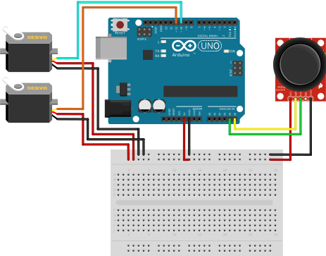

# Arduino Maze Ball

  

Um projeto do controle dos sevos motores de um labirinto.
Ao mover o joystick o labirinto sobre os sevos balança.
O objetivo é levar a bolinha dentro do labirinto até a saída sem cair em nenhum buraco no caminho.

## Uso
Abaixo a montagem da eletrônica do protótipo:

